# 📋 ANALISI FLUSSO ESCALATION - CHATBOT LUCINE DI NATALE

## 🎯 OVERVIEW SISTEMA

Il chatbot implementa un sistema di escalation intelligente che gestisce automaticamente il passaggio da assistente AI a operatore umano, con logiche meccaniche per garantire affidabilità.

---

## 🔄 FLUSSI DI ESCALATION

### 1. **ESCALATION DIRETTA** ⚡
**Trigger**: Richiesta esplicita dell'utente
```
Frasi: "operatore", "assistenza umana", "parlare con persona", "request_operator"
```
**Comportamento**:
- ✅ Connessione immediata se operatore disponibile
- 📱 Creazione ticket se nessun operatore online
- 🔄 Stato sessione: `ACTIVE` → `WITH_OPERATOR` o `REQUESTING_TICKET`

### 2. **ESCALATION CON CONFERMA** 🤖➡️👤
**Trigger**: AI non conosce la risposta (meccanico)
```
Pattern rilevati automaticamente:
- "non ho informazioni specifiche"
- "mi dispiace, non so"
- "vuoi parlare con un operatore"
```
**Comportamento**:
- 🔧 **Logica meccanica**: Backend aggiunge automaticamente pulsanti YES/NO
- ❓ Chiede conferma utente prima di escalare
- ✅ Solo dopo conferma procede con escalation

### 3. **TICKET OFFLINE** 📧
**Trigger**: Nessun operatore disponibile
**Comportamento**:
- 📝 Raccolta dati contatto (email/telefono)
- 🎫 Creazione ticket automatica
- ⏱️ SLA: 2-4 ore tempo risposta

---

## 🔧 LOGICHE MECCANICHE

### **Pattern Detection Engine**
```javascript
const unknownPatterns = [
  /non ho informazioni specifiche/i,
  /mi dispiace.*non so/i,
  /non sono a conoscenza/i,
  /vuoi parlare con un operatore/i
];
```

### **Auto-Injection SmartActions**
Quando rileva pattern "sconosciuto":
```json
{
  "smartActions": [
    {
      "type": "primary",
      "text": "SÌ, CHIAMA OPERATORE", 
      "action": "request_operator"
    },
    {
      "type": "secondary",
      "text": "NO, CONTINUA CON AI",
      "action": "continue_ai"
    }
  ]
}
```

---

## 📊 STATI SESSIONE

| Stato | Descrizione | Comportamento |
|-------|-------------|---------------|
| `ACTIVE` | Chat normale con AI | Widget mostra chat AI |
| `WITH_OPERATOR` | Connesso con operatore | Widget avvia polling messaggi |
| `REQUESTING_TICKET` | Raccolta dati per ticket | Widget mostra form contatti |
| `CLOSED` | Sessione terminata | - |

---

## 🔀 MATRIX DECISIONALE

```mermaid
graph TD
    A[Messaggio Utente] --> B{Richiesta Diretta Operatore?}
    B -->|Sì| C{Operatore Disponibile?}
    B -->|No| D[Elaborazione AI]
    
    C -->|Sì| E[Connessione Immediata]
    C -->|No| F[Creazione Ticket]
    
    D --> G{Pattern Sconosciuto?}
    G -->|Sì| H[Mostra Pulsanti YES/NO]
    G -->|No| I[Risposta AI Normale]
    
    H --> J{Utente Sceglie SÌ?}
    J -->|Sì| C
    J -->|No| K[Continua con AI]
    
    E --> L[Polling Messaggi Operatore]
    F --> M[Form Raccolta Dati]
```



---

## 🛠️ COMPONENTI TECNICI

### **Backend Endpoints**
- `POST /api/chat` - Chat principale + escalation logic
- `GET /api/chat/poll/:sessionId` - Polling messaggi operatore
- `POST /api/operators/send-message` - Invio da operatore
- `POST /api/tickets/create` - Creazione ticket

### **Widget Frontend**
- Pattern meccanico per rilevamento operatore
- Polling automatico ogni 3 secondi
- SmartActions rendering
- Gestione stati sessione

### **Database Schema**
```sql
ChatSession: sessionId, status, lastActivity
OperatorChat: sessionId, operatorId, startedAt, endedAt  
Message: sessionId, sender, message, timestamp
Ticket: sessionId, userEmail, status, priority
```

---

## 📈 METRICHE & ANALYTICS

### **Eventi Tracciati**
- `chat_message` - Ogni messaggio utente/AI
- `escalation_request` - Richiesta operatore
- `operator_connected` - Connessione stabilita
- `ticket_created` - Ticket creato per operatori offline

### **SLA Monitoring**
- Tempo risposta operatore: < 30 secondi
- Tempo risoluzione ticket: 2-4 ore
- Availability operatori: tracking real-time

---

## 🔐 SICUREZZA & VALIDAZIONE

### **Input Sanitization**
- Validazione lunghezza messaggi
- Escape HTML/XSS prevention
- Rate limiting: 10 req/min per IP

### **Autenticazione Operatori**
- JWT tokens con scadenza
- Password hashing (bcrypt, 12 rounds)
- Session validation per ogni azione

---

## 🚀 STATO ATTUALE

### ✅ **Implementato**
- ✅ Escalation diretta funzionante
- ✅ Logica meccanica YES/NO 
- ✅ Polling messaggi operatore
- ✅ Creazione ticket automatica
- ✅ Pattern detection engine
- ✅ Widget v2.7 con tutti i fix

### 🔄 **Da Implementare** 
- Dashboard operatori con azioni chat
- Chiusura manuale sessioni
- Marking risolto/non risolto
- Trasferimento tra operatori
- Statistiche tempo risposta

---

*Documento generato: 30/09/2025*
*Sistema: Chatbot Lucine di Natale v2.7*