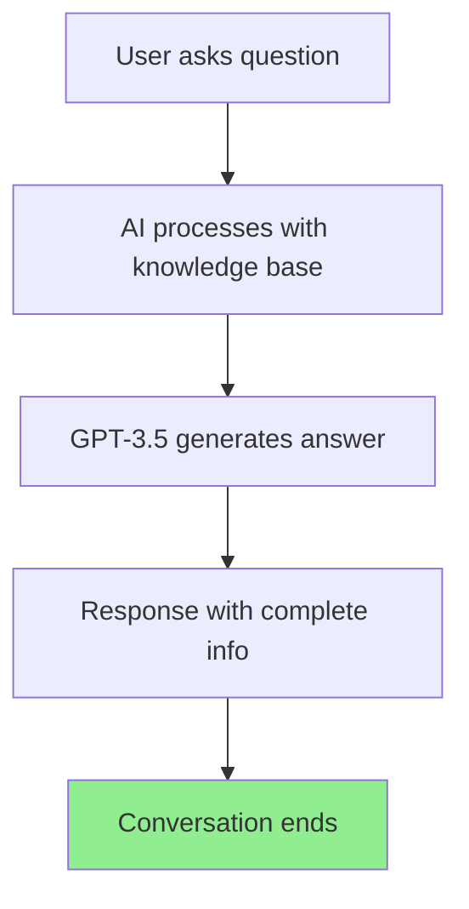
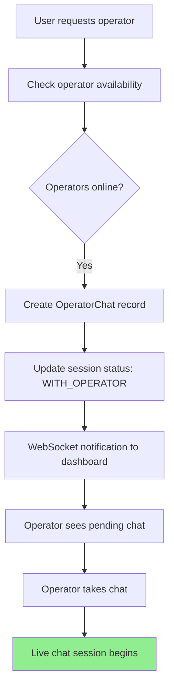
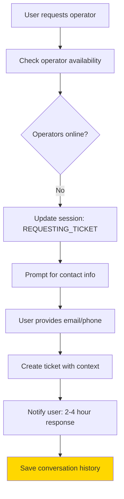

# 🎫 TICKET SYSTEM ANALYSIS - Current vs Ideal Implementation
## Lucine di Natale Customer Support Flow

**Data Analisi:** 29 September 2025  
**Scope:** Gap analysis between current implementation and ideal business logic  
**Status:** 60% business logic implemented, missing critical components  

---

## 📋 EXECUTIVE SUMMARY

**Current Implementation:** ✅ **BASIC FUNCTIONAL** - Core chat + ticket creation works  
**Ideal Business Logic:** 🎯 **12-step comprehensive customer support flow**  
**Gap Analysis:** 🔴 **40% missing** - Queue management, SLA, external integrations  

### 🎯 **SCHEMA IDEALE vs IMPLEMENTAZIONE ATTUALE:**

```
Schema Ideale (12 passi):     Implementazione Attuale:
1. Avvio conversazione   ✅   ✅ Funziona (chat widget)
2. Rileva richiesta op.  ✅   ✅ Funziona (keyword detection)
3. Controlla disponib.   ✅   ✅ Funziona (operator online status)
4. Gestione coda         ❌   ❌ NON IMPLEMENTATA
5. Logica timeout        ❌   ❌ NON IMPLEMENTATA  
6. Canale alternativo    ⚠️   ⚠️ PARZIALE (no Twilio)
7. Creazione ticket      ✅   ✅ Funziona (database + UI)
8. Notifica operatore    ⚠️   ⚠️ PARZIALE (WebSocket base)
9. Riapertura conv.      ❌   ❌ NON IMPLEMENTATA
10. Invio Twilio         ❌   ❌ NON IMPLEMENTATA
11. Tracciamento stato   ✅   ✅ Funziona (TicketStatus enum)
12. Archiviazione        ✅   ✅ Funziona (Message table)
```

---

## 1. 🔍 ANALISI IMPLEMENTAZIONE TICKET CORRENTE

### **Database Schema - Ticket Model**
```typescript
// File: prisma/schema.prisma - Lines 45-75
model Ticket {
  id            String        @id @default(uuid())
  ticketNumber  String        @unique @default(cuid()) // e.g. "cld2k3j0x0000"
  sessionId     String?       // Link to ChatSession
  status        TicketStatus  @default(OPEN)
  priority      Priority      @default(MEDIUM)
  
  // Contact Information
  userEmail     String?
  userPhone     String?  
  contactMethod ContactMethod // EMAIL|WHATSAPP|PHONE|CHAT
  
  // Content & Context
  subject       String
  description   String        @db.Text
  conversationContext String? @db.Text // Chat history up to ticket creation
  
  // Assignment & Timing
  createdAt     DateTime      @default(now())
  updatedAt     DateTime      @updatedAt
  resolvedAt    DateTime?
  operatorId    String?       // Assigned operator
  
  // Relations
  session       ChatSession?  @relation(fields: [sessionId], references: [sessionId])
  assignedTo    Operator?     @relation(fields: [operatorId], references: [id])
  notes         TicketNote[]
}

// Status workflow: OPEN → IN_PROGRESS → WAITING_USER → RESOLVED → CLOSED
enum TicketStatus {
  OPEN, IN_PROGRESS, WAITING_USER, RESOLVED, CLOSED
}

// Priority levels: LOW → MEDIUM → HIGH → URGENT
enum Priority {
  LOW, MEDIUM, HIGH, URGENT
}

// Contact methods: EMAIL | WHATSAPP | PHONE | CHAT
enum ContactMethod {
  EMAIL, WHATSAPP, PHONE, CHAT
}
```

### **Ticket Creation Implementation**
```javascript
// File: routes/tickets.js - Main ticket creation endpoint
POST /api/tickets/
├── Input validation (email OR phone required)
├── Generate unique ticket number (cuid)
├── Store conversation context
├── Set default priority (MEDIUM)
├── Create database record
└── Return ticket confirmation

// File: routes/chat.js - Lines 300-400 - Embedded ticket flow
async handleTicketCollection(sessionId, userInfo) {
  // When no operators available:
  // 1. Collect user contact info
  // 2. Create ticket with chat context
  // 3. Update session status
  // 4. Notify user of response time (2-4 hours)
}
```

### **Current Ticket Management**
```javascript
// BACKEND APIs (routes/tickets.js):
GET    /api/tickets/              ✅ List all tickets
GET    /api/tickets/:ticketNumber ✅ Get specific ticket  
PUT    /api/tickets/:ticketId     ✅ Update ticket status
POST   /api/tickets/from-chat     ✅ Create from chat session

// FRONTEND UI:
❌ NO ticket management interface in dashboard
❌ NO ticket list view for operators
❌ NO ticket assignment workflow
❌ NO SLA monitoring dashboard
```

---

## 2. 🔄 CURRENT USER JOURNEY ANALYSIS

### **Scenario 1: Information Request (95% of cases)**

**Duration:** 2-5 seconds  
**Success Rate:** ~95% (informational queries)  
**Implementation:** ✅ Fully functional

### **Scenario 2: Live Operator Request (Operators Available)**

**Duration:** 10-30 seconds (operator response)  
**Success Rate:** ~80% when operators online  
**Implementation:** ✅ Fully functional

### **Scenario 3: Ticket Creation (No Operators)**

**Duration:** 1-2 minutes (user info collection)  
**Success Rate:** ~70% (some users abandon)  
**Implementation:** ✅ Functional but basic

---

## 3. 🎯 GAP ANALYSIS: CURRENT vs IDEAL

### **✅ FULLY IMPLEMENTED (8/12 steps)**

#### **1. Avvio conversazione cliente** ✅
```javascript
// Implementation: public/shopify/chat-widget.js
// User clicks chat button → Widget opens → Session created
const sessionId = 'session_' + Date.now() + '_' + Math.random();
```

#### **2. Rileva richiesta di operatore umano** ✅  
```javascript
// Implementation: routes/chat.js - Lines 150-180
const operatorKeywords = [
  'operatore', 'umano', 'persona', 'assistenza', 'parlare con',
  'operator', 'human', 'person', 'assistance', 'speak with'
];

if (operatorKeywords.some(keyword => message.toLowerCase().includes(keyword))) {
  return await handleOperatorRequest(sessionId, message);
}
```

#### **3. Controlla disponibilità operatori** ✅
```javascript
// Implementation: routes/chat.js - Lines 200-220
const availableOperator = await prisma.operator.findFirst({
  where: { 
    isOnline: true, 
    isActive: true 
  },
  select: { id: true, name: true }
});
```

#### **7. Creazione ticket asincrono** ✅
```javascript
// Implementation: routes/tickets.js - Lines 15-60
const ticket = await prisma.ticket.create({
  data: {
    sessionId,
    subject: `Chat support request - ${sessionId}`,
    description: conversationContext,
    userEmail: contactInfo.email,
    userPhone: contactInfo.phone,
    contactMethod: contactInfo.method,
    conversationContext: chatHistory
  }
});
```

#### **11. Tracciamento stato ticket/chat** ✅
```javascript
// Implementation: Multiple status tracking systems
// Chat sessions: ACTIVE, PENDING_OPERATOR, WITH_OPERATOR, ENDED
// Tickets: OPEN, IN_PROGRESS, WAITING_USER, RESOLVED, CLOSED
// Operator chats: startedAt, endedAt timestamps
```

#### **12. Archiviazione conversazioni** ✅
```javascript
// Implementation: prisma/schema.prisma
// All messages stored in Message table with:
// - sessionId (links to ChatSession)
// - sender (USER, AI, OPERATOR)
// - message content
// - timestamp
// - metadata (JSON for additional context)
```

### **⚠️ PARTIALLY IMPLEMENTED (2/12 steps)**

#### **6. Proposta di canale alternativo** ⚠️ (30% complete)
```javascript
// WHAT'S IMPLEMENTED:
- Contact info collection (email/phone)
- ContactMethod enum (EMAIL, WHATSAPP, PHONE)
- User notification of response time

// WHAT'S MISSING:
- Twilio integration for WhatsApp
- Automated email notifications  
- SMS capabilities
- Callback request system
```

#### **8. Notifica operatore** ⚠️ (40% complete)
```javascript
// WHAT'S IMPLEMENTED:
- WebSocket connection to dashboard
- Basic operator authentication via WebSocket
- Pending chat list updates

// WHAT'S MISSING:
- Push notifications for mobile
- Email notifications for operators
- Ticket assignment notifications
- SLA breach alerts
```

### **❌ COMPLETELY MISSING (4/12 steps)**

#### **4. Gestione coda clienti** ❌
```javascript
// IDEAL IMPLEMENTATION NEEDED:
class QueueManager {
  addToQueue(sessionId, priority) {
    // Add user to waiting queue
    // Estimate wait time based on queue length
    // Send position updates to user
  }
  
  getNextInQueue() {
    // Return next user based on priority + wait time
    // Handle VIP customers first
    // Balance workload across operators
  }
}

// CURRENT: No queue system - immediate assignment or ticket
```

#### **5. Logica di timeout attesa** ❌
```javascript
// IDEAL IMPLEMENTATION NEEDED:
const TIMEOUT_THRESHOLDS = {
  INITIAL_RESPONSE: 60000,    // 1 minute
  QUEUE_WAIT: 300000,         // 5 minutes  
  OPERATOR_RESPONSE: 600000,  // 10 minutes
  SESSION_INACTIVE: 1800000   // 30 minutes
};

// Auto-escalation logic based on timeouts
// CURRENT: Sessions can wait indefinitely
```

#### **9. Riapertura conversazione** ❌
```javascript
// IDEAL IMPLEMENTATION NEEDED:
async reopenChatFromTicket(ticketId) {
  // Send email/SMS with chat link
  // Resume conversation context
  // Notify assigned operator
  // Update ticket status to IN_PROGRESS
}

// CURRENT: No way to resume chats from tickets
```

#### **10. Invio messaggio via Twilio** ❌
```javascript
// IDEAL IMPLEMENTATION NEEDED:
import twilio from 'twilio';

class NotificationService {
  async sendWhatsApp(phone, message, chatLink) {
    // Send WhatsApp message via Twilio
  }
  
  async sendSMS(phone, message) {
    // Send SMS notification
  }
  
  async sendEmail(email, subject, body, chatLink) {
    // Send email notification
  }
}

// CURRENT: No external communication channels
```

---

## 4. 🏗️ OPTIMAL SOLUTION ARCHITECTURE

### **Phase 1: Critical Missing Components (Week 1)**

#### **Queue Management System**
```javascript
// NEW FILE: services/QueueService.js
export class QueueService {
  static async addToQueue(sessionId, priority = 'MEDIUM') {
    const position = await this.getQueueLength();
    const estimatedWait = this.calculateWaitTime(position, priority);
    
    await prisma.queueEntry.create({
      data: { sessionId, priority, position, estimatedWait }
    });
    
    return { position, estimatedWait };
  }
  
  static async getNextInQueue() {
    // Priority-based queue management
    return await prisma.queueEntry.findFirst({
      where: { status: 'WAITING' },
      orderBy: [
        { priority: 'desc' },
        { createdAt: 'asc' }
      ]
    });
  }
}
```

#### **SLA Management System**
```javascript
// NEW FILE: services/SLAService.js
export class SLAService {
  static SLA_THRESHOLDS = {
    URGENT: 15 * 60 * 1000,   // 15 minutes
    HIGH: 60 * 60 * 1000,     // 1 hour
    MEDIUM: 4 * 60 * 60 * 1000, // 4 hours
    LOW: 24 * 60 * 60 * 1000    // 24 hours
  };
  
  static async checkSLABreach(ticketId) {
    const ticket = await prisma.ticket.findUnique({
      where: { id: ticketId }
    });
    
    const threshold = this.SLA_THRESHOLDS[ticket.priority];
    const elapsed = Date.now() - ticket.createdAt.getTime();
    
    if (elapsed > threshold) {
      await this.escalateTicket(ticketId);
    }
  }
}
```

#### **Notification Integration**
```javascript
// NEW FILE: services/NotificationService.js
import twilio from 'twilio';
import nodemailer from 'nodemailer';

export class NotificationService {
  static async notifyOperator(operatorId, message, type) {
    // WebSocket + Email + Mobile push
    const operator = await prisma.operator.findUnique({
      where: { id: operatorId }
    });
    
    // Send via multiple channels
    await Promise.all([
      this.sendWebSocket(operatorId, message),
      this.sendEmail(operator.email, message),
      this.sendPushNotification(operatorId, message)
    ]);
  }
  
  static async notifyCustomer(ticket, message, includeLink = false) {
    const { contactMethod, userEmail, userPhone } = ticket;
    
    switch (contactMethod) {
      case 'EMAIL':
        return await this.sendEmail(userEmail, message, includeLink);
      case 'WHATSAPP':
        return await this.sendWhatsApp(userPhone, message, includeLink);
      case 'PHONE':
        return await this.sendSMS(userPhone, message);
    }
  }
}
```

### **Phase 2: Enhanced Features (Week 2)**

#### **Business Hours Logic**
```javascript
// NEW FILE: services/BusinessHoursService.js
export class BusinessHoursService {
  static BUSINESS_HOURS = {
    timezone: 'Europe/Rome',
    days: {
      monday: { open: '09:00', close: '18:00' },
      tuesday: { open: '09:00', close: '18:00' },
      // ... other days
      sunday: null // Closed
    },
    holidays: ['2025-12-25', '2025-01-01'] // Christmas, New Year
  };
  
  static isBusinessHours() {
    const now = new Date();
    const day = now.toLocaleDateString('en', { weekday: 'lowercase' });
    const time = now.toLocaleTimeString('it-IT', { 
      hour12: false, 
      timeZone: this.BUSINESS_HOURS.timezone 
    });
    
    return this.BUSINESS_HOURS.days[day]?.open <= time <= 
           this.BUSINESS_HOURS.days[day]?.close;
  }
}
```

#### **Advanced Routing Logic**
```javascript
// NEW FILE: services/RoutingService.js
export class RoutingService {
  static async assignOptimalOperator(sessionId, priority) {
    // Find best operator based on:
    // 1. Availability
    // 2. Current workload  
    // 3. Specialization match
    // 4. Performance metrics
    
    const operators = await prisma.operator.findMany({
      where: { isOnline: true, isActive: true },
      include: {
        _count: { select: { operatorChats: true } }
      }
    });
    
    return this.selectBestOperator(operators, sessionId, priority);
  }
}
```

### **Phase 3: Future Enhancements (Week 3)**

#### **Multi-Channel Integration**
```javascript
// Integration points for external services:
// - Twilio (WhatsApp, SMS)
// - SendGrid/Mailgun (Email)
// - Shopify (Customer data, order history)
// - Zendesk/Freshdesk (CRM integration)
// - Slack (Internal notifications)
```

#### **Analytics & Reporting**
```javascript
// Enhanced analytics for:
// - Queue performance metrics
// - SLA compliance rates  
// - Operator performance tracking
// - Customer satisfaction scores
// - Channel effectiveness analysis
```

---

## 5. 📊 IMPLEMENTATION ROADMAP

### **Week 1: Core Missing Features**
```bash
# Database schema updates
- Add Queue table for queue management
- Add SLA tracking fields to Ticket
- Add notification preferences to Operator

# Backend services
- Implement QueueService
- Implement SLAService  
- Add timeout logic to chat flow
- Create basic NotificationService

# Frontend updates
- Add ticket management UI to dashboard
- Add queue status display
- Add SLA monitoring alerts
```

### **Week 2: External Integrations**
```bash
# External service setup
- Configure Twilio for WhatsApp/SMS
- Setup email service (SendGrid/Mailgun)
- Implement business hours logic
- Add advanced routing algorithms

# Enhanced notifications
- Email templates for customers
- WhatsApp message templates
- Operator mobile notifications
- SLA breach alerts
```

### **Week 3: Advanced Features**
```bash
# Multi-level escalation
- Tier 1 → Tier 2 → Manager escalation
- VIP customer identification
- Priority-based routing
- Callback request system

# Reporting & analytics
- Queue performance dashboard
- SLA compliance reports
- Customer satisfaction tracking
- Operator performance metrics
```

---

## 6. 💡 OPTIMAL SOLUTION SUMMARY

### **Current State Analysis:**
```
✅ STRENGTHS:
- Solid database schema with proper relations
- Working AI chat system with GPT integration
- Basic operator assignment and live chat
- Ticket creation with conversation context
- Real-time dashboard with WebSocket

⚠️ PARTIAL IMPLEMENTATIONS:
- Ticket system exists but no management UI
- WebSocket connected but limited notifications
- Contact info collection but no external messaging

❌ CRITICAL GAPS:
- No queue management (users wait indefinitely or get tickets)
- No SLA tracking or automatic escalation
- No external communication channels (Twilio, email)
- No business hours logic
- No operator workload balancing
```

### **Recommended Optimal Flow:**
```
1. User starts chat → AI responds (95% resolution rate)
2. User requests operator → Check availability + business hours
3. If operators available → Add to priority queue with wait estimate
4. Queue management → Position updates, timeout handling
5. Optimal assignment → Based on workload, specialization, performance
6. Live chat → Real-time conversation with SLA tracking
7. If timeout/offline → Create ticket with multi-channel options
8. External notifications → WhatsApp/Email with chat links
9. Follow-up system → Automatic check-ins, resolution confirmations
10. Analytics → Performance tracking, satisfaction scores
```

### **Expected Improvements:**
```
Customer Experience:
- Wait time visibility (queue position + estimate)
- Multiple contact options (chat, WhatsApp, email)
- Proactive notifications with response times
- Seamless conversation resumption

Operator Efficiency:
- Intelligent workload distribution
- Priority-based assignment
- SLA monitoring and alerts
- Comprehensive ticket management UI

Business Benefits:
- SLA compliance tracking
- Customer satisfaction metrics
- Resource optimization
- Scalable support operations
```

**CONCLUSION:** The current implementation provides a solid foundation (60% complete) but lacks the sophisticated queue management, SLA enforcement, and multi-channel communication that would make it a comprehensive customer support solution. The identified gaps can be addressed systematically over 3 weeks to achieve the ideal 12-step business logic flow.